<div align="center">

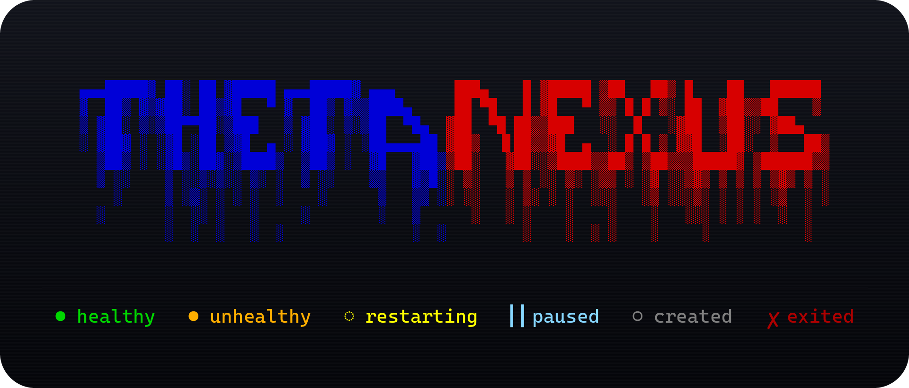

<br>
<br>

[](LICENSE)
[](https://dotnet.microsoft.com/en-us/download/dotnet/10.0)
[](#build-it-yourself)
[](https://www.docker.com/products/docker-desktop/)
[](https://stardance.hackclub.com/projects/44647)

</div>

## Table of contents

- [Why](#why)
- [Quick start](#quick-start)
- [The list](#the-list)
    - [Doing something to a container](#doing-something-to-a-container)
    - [Finding one](#finding-one)
- [A container, up close](#a-container-up-close)
    - [Logs](#logs)
    - [Stats](#stats)
    - [Files](#files)
- [Images, and starting something new](#images-and-starting-something-new)
- [Volumes, networks and events](#volumes-networks-and-events)
- [Cleaning up](#cleaning-up)
- [Every key](#every-key)
- [Build it yourself](#build-it-yourself)
- [What it is built on](#what-it-is-built-on)
- [Credits](#credits)
- [License](#license)

## Why

Docker Desktop is a good program, but it takes a long time to open, you are running a desktop
application to look at a list, and the thing you wanted is four clicks away. The command line is the
opposite. It is instant, but every answer is a separate command. `docker ps` for what is running,
`docker stats` for what it is costing you, `docker logs` for what it is saying, and `docker inspect`
when you want to know why a healthcheck went red.

ThetaNexus sits between them.

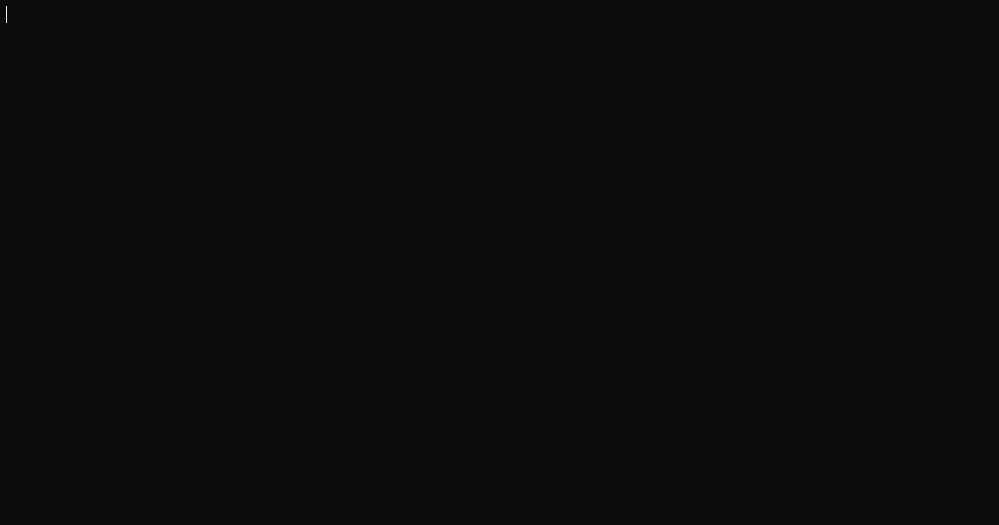

It reads the engine directly over its named pipe, so it does not need Docker Desktop's window open
at all, only its engine running.

## Quick start

Download the installer from the [latest release](https://github.com/lixtheyt/ThetaNexus/releases/latest)
and run it:

```
ThetaNexus-1.0.0-setup.exe
```

It installs into your user folder and adds ThetaNexus to `PATH`, so you can start it from anywhere:

```
thetanexus
```

No administrator rights are needed. The only thing it changes outside its own folder is your
`PATH`, and the uninstaller puts that back.

Use **Windows Terminal** rather than `cmd.exe` or `powershell.exe`. The older two cannot draw the
braille characters the graphs are made of, and the colours come out wrong.

If the engine is not running when you start, ThetaNexus tells you what it tried and why it
failed.

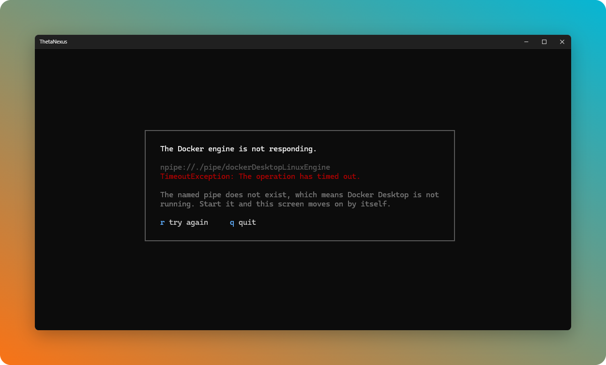

## The list

ThetaNexus opens on your containers. Anything Docker Compose started is grouped under its project
name, and `c` collapses the group you are on.


The state column is a glyph and a word, not a colour on its own. A colour on its own is no use to
somebody who cannot see it, and "exited" and "exited 137" are not the same.

`1` to `5` jump between containers, images, volumes, networks and events. The arrow keys do the
same thing.

### Doing something to a container

`␣` starts or stops whatever the cursor is on, `r` restarts, `p` pauses and unpauses, and `k` kills
without waiting for a clean shutdown. Every one of them reports back what actually happened, taken
from the engine's own error rather than from a status code.

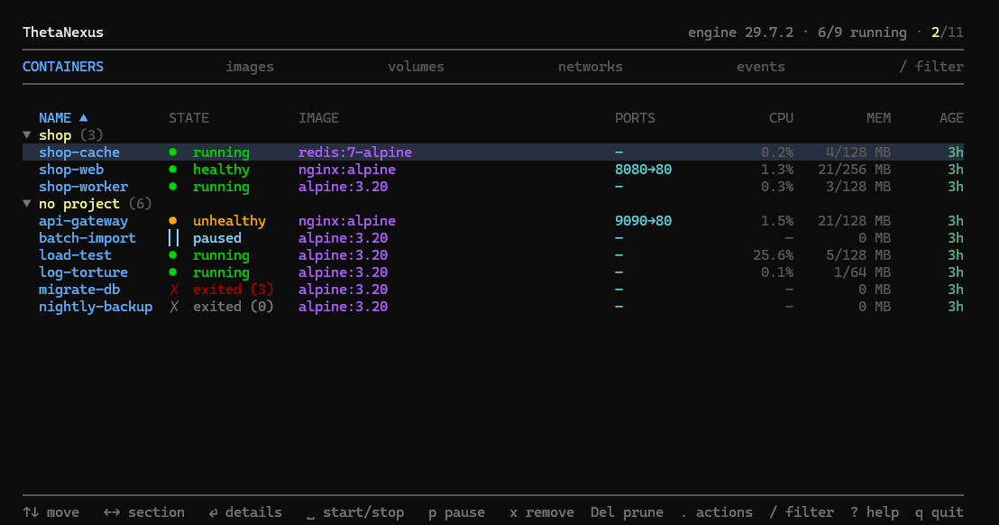

`.` opens an action menu for the row you are on, and it
lists only what that container can do in the state it is in right now. A stopped container is not
offered a shell, and a running one is not offered a start.

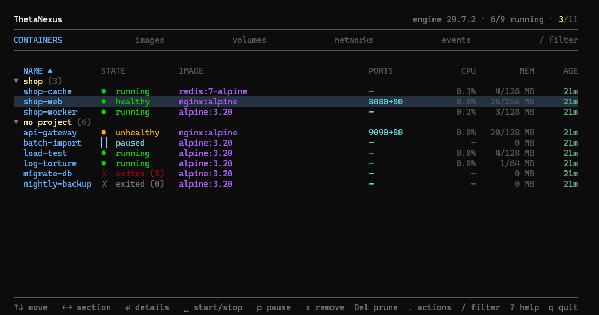

### Finding one

`/` filters by name or image as you type. `TAB` sorts by the next column and `SHIFT+TAB` turns the
sort around, remembered per section. Events are the exception. They have no columns to sort, so
there `SHIFT+TAB` swaps newest first for oldest first on its own.


## A container, up close

`⏎` opens the container. Overview, environment, mounts, networks, health and files are tabs.


Environment values are hidden until you press `v`, so you do not show somebody an API token you
forgot was in there.

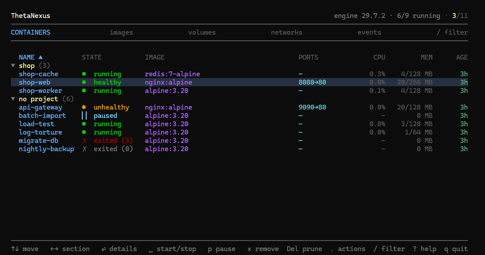

Health shows every probe the engine has kept, with its exit code and what it printed. Knowing that
a container is unhealthy is not useful on its own. Knowing which check failed and what it said is.

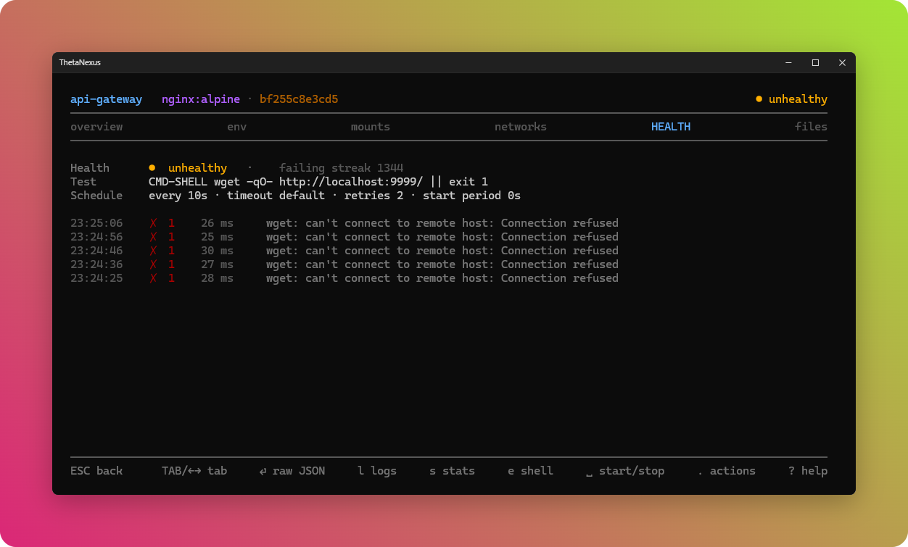

`⏎` on any other tab opens the raw JSON, the same thing `docker inspect` gives you, in a pager, for
the times when the tabs do not have the one field you need.


### Logs

`l` opens the logs. They follow by default, and scrolling up stops the following. 
`f` or `End` puts you back on the newest line.


`/` searches and `n` and `N` walk through the matches, with the count in the header.

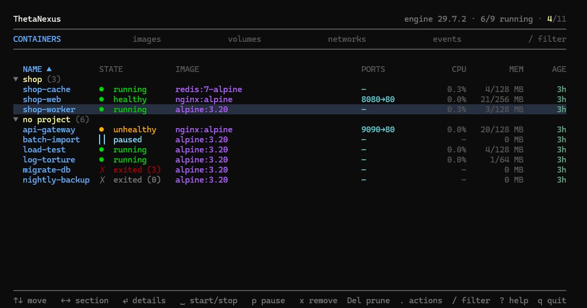

`w` wraps long lines instead of cropping them, `t` turns on the engine's timestamps, and `+` and `-`
double or halve how many lines are kept, because `docker logs` on a container that has been up for
a month will otherwise pull hundreds of megabytes into memory. `SHIFT+S` writes the whole buffer to
a file in your Downloads folder and tells you the path.

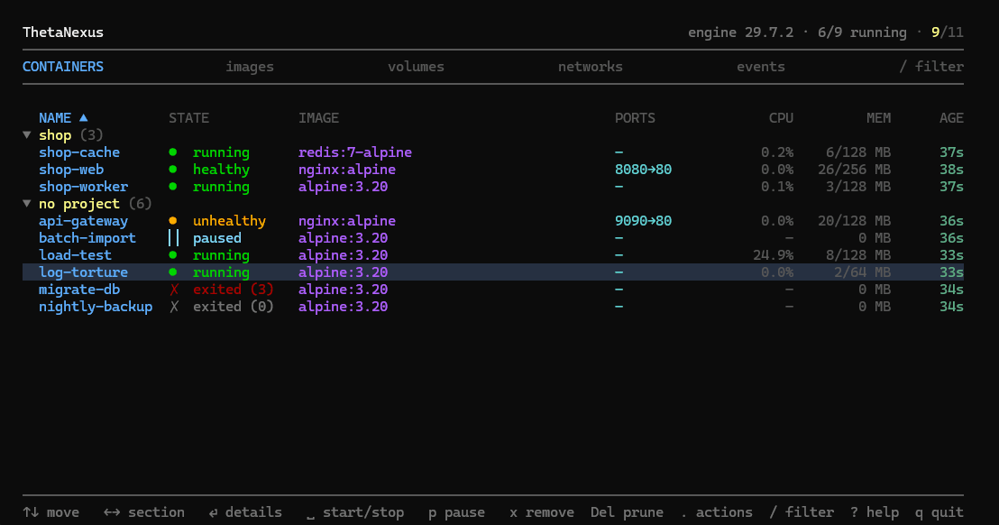

stdout and stderr arrive together down one stream, eight bytes of header in front of every frame.
Which of the two a line came from is half of what you need to know, so ThetaNexus separates them
again and marks stderr with a red `!` in the gutter.

Log output is also drawn as the characters it is and never as instructions. `[red]` is a pair of
brackets and a word, a lone `[` is a bracket, and an ANSI escape is stripped.

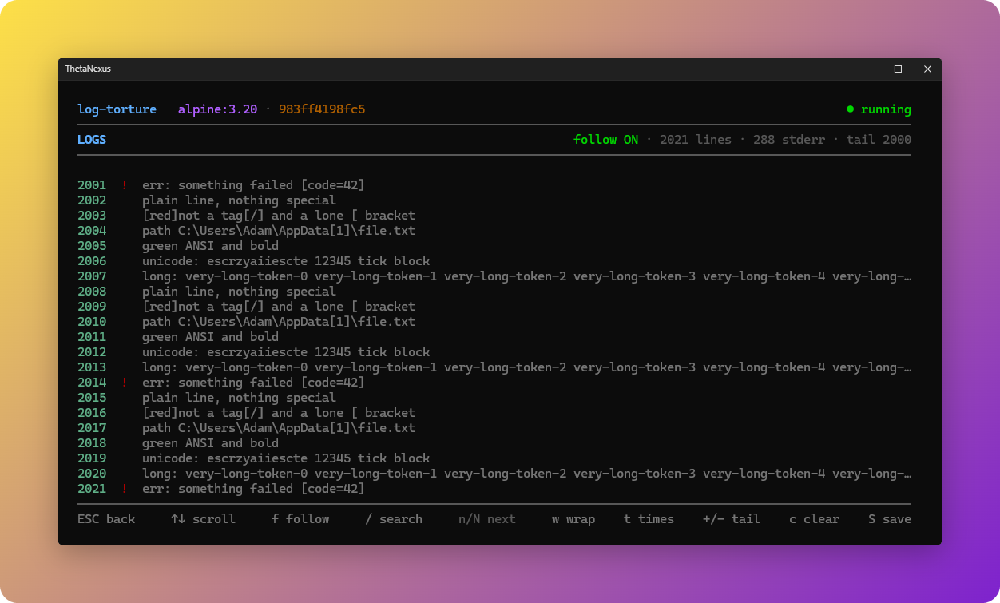

### Stats

`s` opens live stats. CPU, memory, network and disk each get a tab with a braille graph and the
numbers that go with it, such as throttled periods, page faults, traffic per interface and the read
and write split.

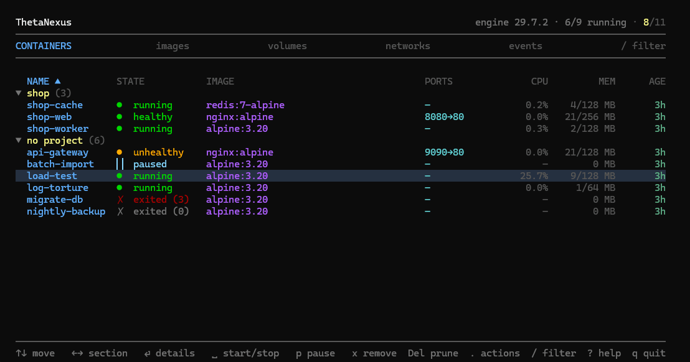

`g` drops the numbers and puts all four graphs on screen at once.


The CPU graph is scaled against the limit the container was given, not against the whole machine,
and the limit is printed beside it. A container capped at a quarter of a core reads 25 per cent
when it is working as hard as it is allowed to, and the graph is full.

### Files

The files tab walks the filesystem inside a running container. `⏎` enters a directory, `⌫` goes back
up.


## Images, and starting something new

`2` switches to images. Untagged leftovers are greyed rather than hidden, and each row shows what
the image is called, how big it is and whether anything is using it.

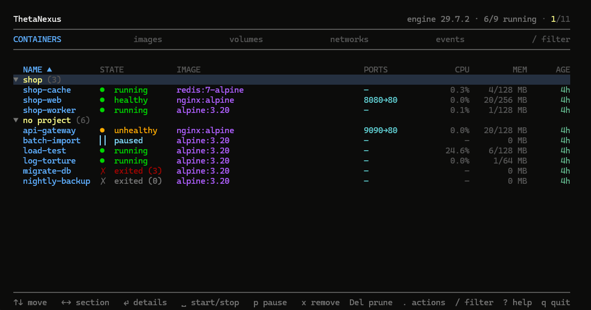

`⏎` opens one. Overview carries the id, the size, the entrypoint, the command and the exposed
ports, and the other three tabs are its layers, the environment it was built with, and its labels.

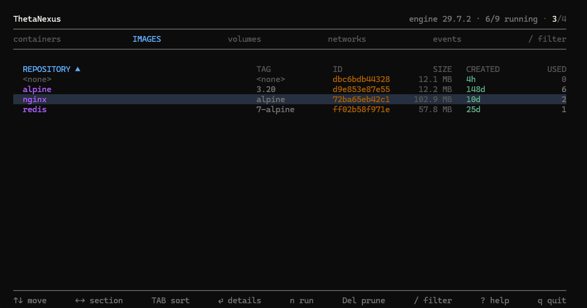

`n` on an image opens a form: name, command, ports, volumes, environment, network, restart policy,
and whether to remove the container when it exits.

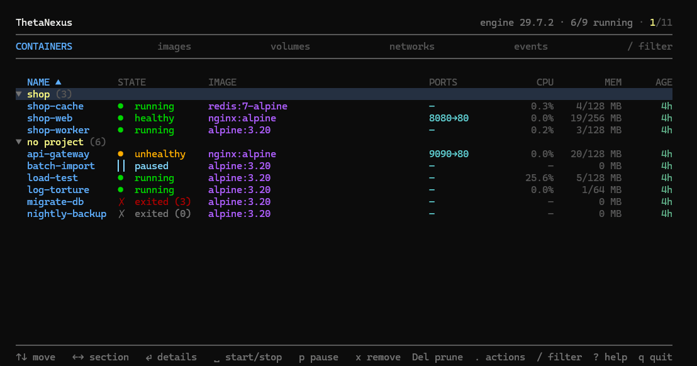

Nothing is sent to the engine until `^R`, and when you press it the form checks its own input first.
A port mapping that is not `host:container` is refused outright rather than quietly dropped, and a
port or a name another container is already holding is refused with the name of whatever is holding
it.

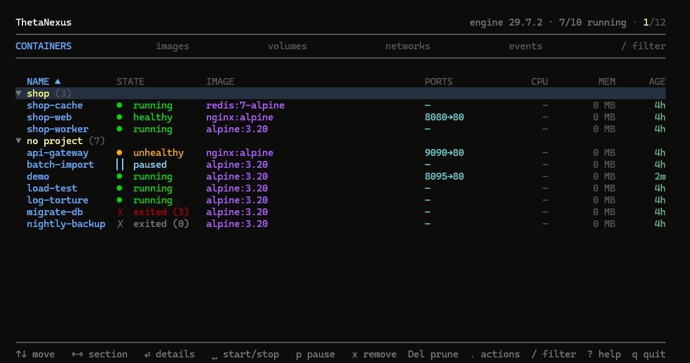

There is one more thing it does that you will only notice when it is missing. Docker binds a port
when a container **starts**, not when it is created. A port held by something outside Docker will
therefore let the create succeed and the start fail, and a dead container is left behind in
`created`. ThetaNexus deletes the one it just made.

## Volumes, networks and events

Volumes and networks each get a list and a detail screen. A volume shows its driver, its mountpoint
and which containers have it attached. A network shows its driver, scope, subnet and gateway, and
everything connected to it with the address it was given.

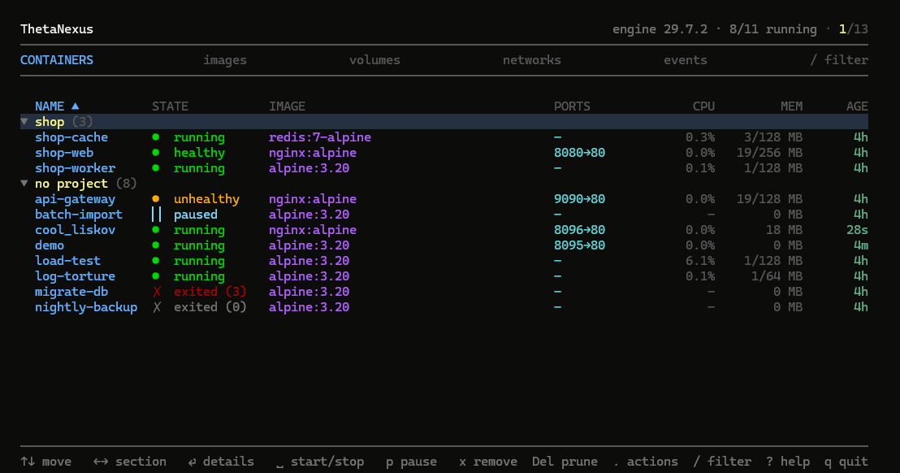

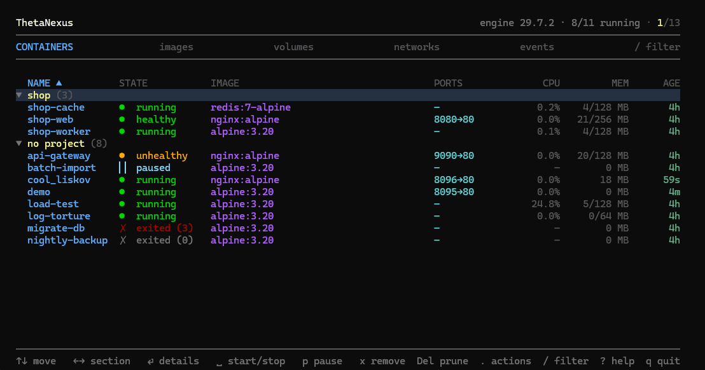

Removing a volume makes you type its name first, because a volume is usually the only copy of
something. Deleting `bridge`, `host` or `none` is refused, because the engine would refuse it too.

`5` is a live feed of everything the engine is doing as it happens. `f` filters by type, `c` clears
the buffer, and `␣` freezes the view.

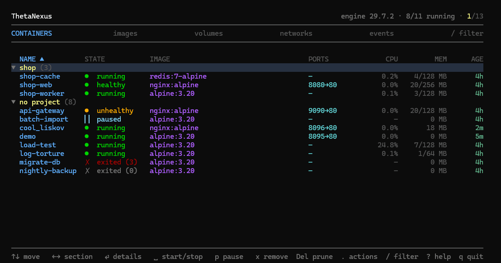

## Cleaning up

`Del` prunes the section you are in and always asks first. In the containers section it counts what
it is about to remove, because those have names you chose. `x` removes the single container under
the cursor and asks as well.

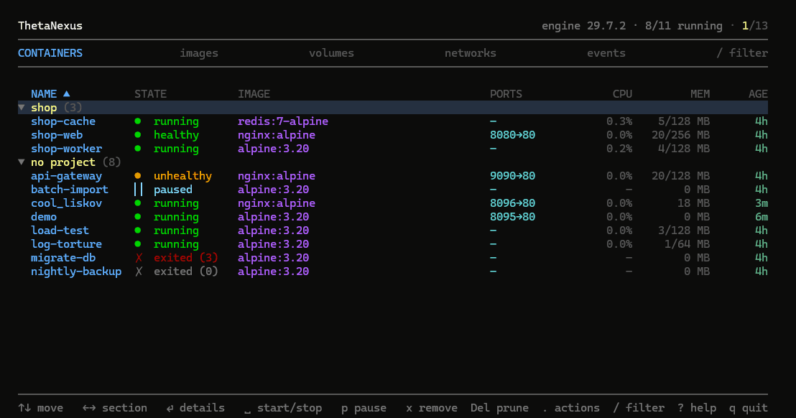

What prune removes is different in each section.

| Section | What `Del` removes | What it keeps |
| --- | --- | --- |
| Containers | every stopped container | anything still running |
| Images | untagged leftovers, the `<none>` rows | every image that still has a tag |
| Volumes | unnamed leftovers | every volume you gave a name to |
| Networks | networks with nothing attached | `bridge`, `host` and `none` |

An untagged image is not a broken one. It is usually a perfectly good image that lost its name when
you rebuilt the same tag, and an unnamed volume is the same story. Prune looks for things that lost
their name, not for things that went wrong. That is why anything you named yourself survives it.

## Every key

`?` opens the same list inside the app, from the list or from a container.

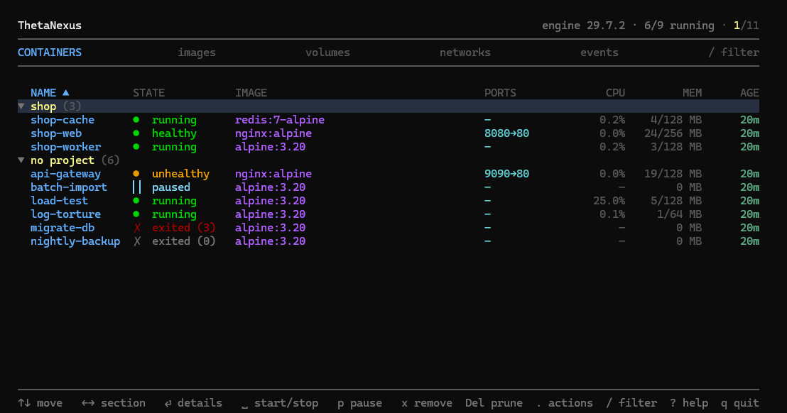

| Where | Key | What it does |
| --- | --- | --- |
| Anywhere | `?` | this list |
| | `esc` | back |
| Help | `u` | ask GitHub whether there is a newer version |
| List | `↑↓` `←→` | move, switch section |
| | `1` to `5` | jump to a section |
| | `TAB` `SHIFT+TAB` | sort by the next column, invert it |
| | `/` | filter by name |
| | `⏎` | open |
| | `Del` | prune this section |
| | `q` | quit |
| Container | `␣` `r` `p` `k` | start or stop, restart, pause, kill |
| | `.` | action menu for the selected container |
| | `x` | remove |
| | `l` `s` `e` | logs, stats, shell |
| | `o` | open its published port in a browser |
| | `c` | collapse a compose project |
| | `v` | reveal env values |
| Logs | `f` | follow |
| | `/` `n` `N` | search, next, previous |
| | `w` `t` | wrap, timestamps |
| | `+` `-` | keep more or fewer lines |
| | `c` `SHIFT+S` | clear, save to a file |
| Stats | `TAB` `←→` | switch tab |
| | `g` | all four graphs |
| | `c` | clear the history |
| Files | `⏎` `⌫` | enter a directory, go up |
| Images | `n` | run a new container from this image |
| Events | `f` `␣` `c` | filter by type, freeze, clear |

`e` on a running container hands you a shell inside it, picking `bash` if the image has one and
falling back to `sh` if it does not.


## Build it yourself

You need Windows, [.NET 10](https://dotnet.microsoft.com/en-us/download/dotnet/10.0) and a running
Docker engine. Nothing else.

```sh
git clone https://github.com/lixtheyt/ThetaNexus.git
cd ThetaNexus
dotnet build ThetaNexus/ThetaNexus.csproj -c Release
```

The executable is exported to `ThetaNexus/bin/Release/net10.0`.

If you want a single file, publish it instead:

```sh
dotnet publish ThetaNexus/ThetaNexus.csproj -p:PublishProfile=SingleFile
```

The single file is exported to `publish/ThetaNexus.exe`.

## What it is built on

**Docker.DotNet is the brain, not a feature.** ThetaNexus talks to the engine through
[Docker.DotNet](https://github.com/dotnet/Docker.DotNet) over the named pipe, not by running
`docker` and reading what comes back. Parsing CLI output is fragile, and it throws away everything
the API already returns as structured data.

**Spectre.Console is the heart, not a helper library.**
[Spectre.Console](https://github.com/spectreconsole/spectre.console) draws every row, panel and
prompt. The container list is not a `Table`, though. The cursor is a highlight across the whole row,
and a table renders cell by cell, so the background would not cover the padding between the columns.

## Credits

ThetaNexus exists because of [Spectre.Console](https://github.com/spectreconsole/spectre.console),
its heart. The whole interface runs on it and it can genuinely do anything you ask of it.

And [Docker.DotNet](https://github.com/dotnet/Docker.DotNet), its brain, which is what lets
ThetaNexus talk to the engine properly instead of shelling out to `docker`.

The splash screen is drawn with Bloody, a figlet font taken from
[xero's collection](https://github.com/xero/figlet-fonts).

## License

ThetaNexus is MIT. See [LICENSE](LICENSE).

Licenses of used libraries:

| Package | License |
| --- | --- |
| [Spectre.Console](https://github.com/spectreconsole/spectre.console) | MIT |
| [Docker.DotNet](https://github.com/dotnet/Docker.DotNet) | MIT |
| [Newtonsoft.Json](https://github.com/JamesNK/Newtonsoft.Json) | MIT |
